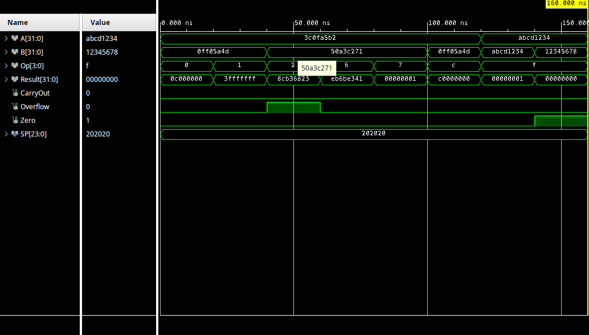

# 32-bit Arithmatic Logic Unit

This project implements a 32-bit Arithmetic Logic Unit (ALU) using behavioral Verilog. It supports a range of arithmetic and logical operations and generates key status flags.

## Supported Operations

- AND  
- OR  
- ADD (signed, with CarryOut and Overflow)  
- SUB (signed, with Overflow)  
- SLT (signed set-less-than)  
- NOR  
- EQ (equality comparison)  
- Default: ADD

## Outputs

- `Result` — 32-bit operation result  
- `CarryOut` — carry out from addition  
- `Overflow` — signed overflow detection  
- `Zero` — asserted when Result is 0  

## Design Style

- Behavioral Verilog (`always @(*)`)
- Case-based operation decoding
- Signed arithmetic using `$signed`
- 33-bit intermediate for carry handling

## Waveform Example

## Files

- `alu32.v` — ALU design module
- `alu32_tb.v` — testbench for simulation

## Simulation

Run using Vivado or any Verilog simulator supporting behavioral simulation.